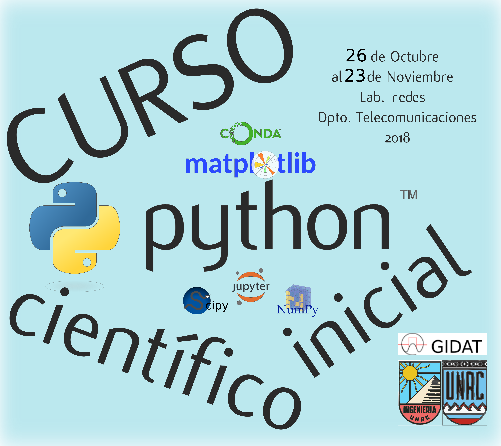

# Curso básico Python científico Ingeniería UNRC

Este es un "fork" del [curso-python-cientifico
](https://github.com/mgaitan/curso-python-cientifico) de **Martín Gaitán**, con algunas modificaciones a fin de destinarlo a estudiantes de primer año de Ing. en Telecomunicaciones de la UNRC, impartido por:

* Bibiana Rivadeneira, ayudante de segunda de Introducción a la Ing. en Telecomunicaciones.
* Héctor Buri, ayudante de segunda del laboratorio de Redes.
* Sebastián Tosco, Ing. en Telecomunicaciones de GIDAT.
* Fernando Corteggiano, Ing. en Telecomunicaciones de GIDAT.

## Descripción

Se busca proveer una introducción sólida al poderoso lenguaje de programación Python (http://python.org) y a las herramientas fundamentales del "ecosistema científico" (Jupyter, Numpy, Matplotlib, Scipy, entre otras) que conforman un entorno de programación interactivo de vanguardia, simple, libre, gratuito y multiplataforma como herramienta de apoyo de la ingeniería y el desarrollo científico-tecnológico.

## Temario

### CLASE 1
#### Introducción
* ¿Por que Python?
* Motivación y proyección de la actividad

#### Instalación
* ¿Cómo se usa Python?
* Ipython Notebook (Jupyter)

#### ¡Queremos programar!
* En el principio: Números
* Outs vs prints
* Más funciones matemáticas

#### Todo es un "objeto"
* Texto
* Indizado y rebanado
* Longitud de una secuencia
* Listas y tuplas: contenedores universales

#### Estructuras de control de flujos
* if/elif/else
* For
* While
* Diccionarios
* Conjuntos

#### Funciones
* Parámetros y más parámetros
* Un paréntesis: docstrings
* Múltiples puntos de salida
* Parámetros opcionales
* Espacios de nombre y paso por asignación

* Generadores
* Manejo de excepciones

### CLASE 3

#### Programación Orientada a Objetos, una brevísima introducción

* Herencia
* Ejercicios

* Módulos y paquetes
* Biblioteca estándar: las baterías puestas de Python
* Números aleatorios
* Escribir programas de línea de comando

### CLASE 4

* Numpy, todo es un array
  * Dimensiones, tamaño, tipo, forma
  * Vistas
  * Otras funciones constructoras de arrays
  * Vectorización y funciones universales
  * Otras herramientas de numpy

* Matplotlib, un gráfico vale más que mil palabras
  * Matplolib orientado a objeto
  * Gráficos 3D

### CLASE 5

* Scipy: parado sobre hombros de gigantes
  * Integrales
  * Integración de funciones con parámetros adicionales

* Optimización y ajuste de curvas
  * Encontrar mínimos
  * Transformada de Fourier
